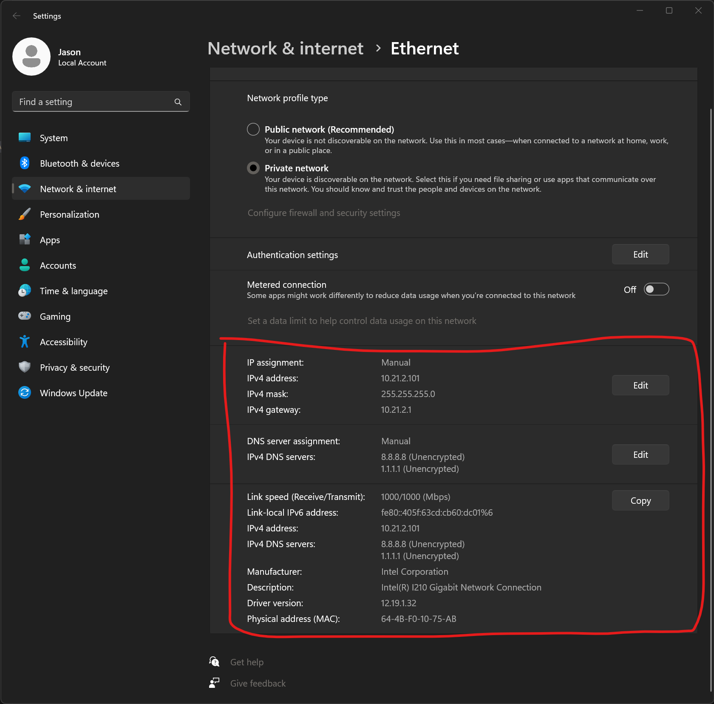

# SBX 360

Z-Cam Controller for the SBX 360

# Camera Connection Setup (Using the built in ethernet port)
This method require disabling and enableing static IP settings. If possible use the method that uses an additional USB Network Adaptor.
1. Connect the GL-MT1300 to Power.

2. Reset the GL-MT1300 by pressing and holding the reset button for **15 seconds** 

3. In Windows Settings under Network and Internet -> Ethernet Record the current network Settings. On a typical event these are set to a static IP and the settings MUST be recorded before continueing.  

4. After recording the settings, change the settings to **Automatic (DHCP)**.  

5. Remove the network cable that connects the SBX Router to the Computer. Connect a network cable from the computer to the GL-MT1300 **LAN** port.  

6. The GL-MT1300 should should up as the network on the newly connected adaptor in the **Network Connections** window.  

7. The admin of the GL-MT1300 is accessible is listed on the back of the device. It is usually **192.168.8.1**.

8. Navigate to the admin page of the GL-MT1300 using the IP address listed on the back of the device.  
9. Select English as the language.
10. Set the Admin password to the normal SBX Wifi Admin Password. 
11. On the left menu, Select **More Settings**.
12. Select **Network Mode**.
13. Under **Switch Mode** select **WDS**. 
14. Select the Network that you want to connect to. **Select the 5G version** 
15. Click Apply. 
16. If successful you should see a message with directions to access the router. Click Close. 
17. In Windows Settings under Network and Internet -> Ethernet. Set the settings back to the original settings that were recorded in step 3. 
  * Typical SBX settings are (These may be different for your event):
    * IP Address: 10.21.2.101
    * Subnet Mask: 255.255.255.0
    * Default Gateway: 10.21.2.1
    * Preferred DNS Server: 8.8.8.8
    * Alternate DNS Server: 1.1.1.1 

# Camera Connection Setup (With an Additional USB Network Adaptor)
This guide **requires** the use of a seperate USB Network Adaptor. This is **NOT** the adaptor that connects the computer to the SBX Router.
1. Connect the GL-MT1300 Power.

2. Reset the GL-MT1300 by pressing and holding the reset button for **15 seconds** 

3. Connect an external USB Network Adapter to the computer via USB. Connect a network cable from the USB Network Adapter to the GL-MT1300 **LAN** port.  

4. The GL-MT1300 should should up as the network on the newly connected adaptor in the **Network Connections** window.  

5. The admin of the GL-MT1300 is accessible is listed on the back of the device. It is usually **192.168.8.1**.

6. Navigate to the admin page of the GL-MT1300 using the IP address listed on the back of the device.  
7. Select English as the language.
8. Set the Admin password to the normal SBX Wifi Admin Password. 
9. On the left menu, Select **More Settings**.
10. Select **Network Mode**.
11. Under **Switch Mode** select **WDS**. 
12. Select the Network that you want to connect to. **Select the 5G version** 
13. Click Apply. 
14. If successful you should see a message with directions to access the router. Click Close. 
15. The **Network Connections** window should now show the same network for the USB Ethernet Adapter and the ethernet adaptor that is connected to the SBX Router. 